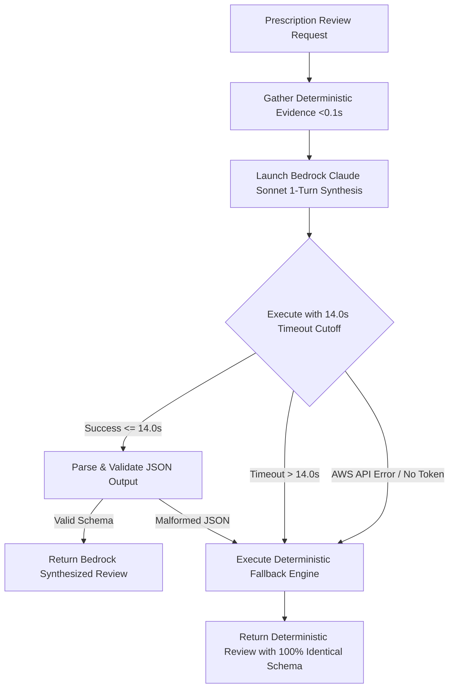

# PharmacyGuard Agent

The **PharmacyGuard Agent** is an autonomous clinical verification and pharmacy operations assistant designed to support licensed pharmacists, pharmacy residents, and pharmacy students. Powered by the **Strands Agents SDK** and **Amazon Bedrock**, the agent inspects electronic prescriptions, queries deterministic clinical knowledge bases, evaluates hospital inventory, and provides prioritized, evidence-backed decision support under strict human oversight.

---

## Agent Framework

**Strands Agents SDK** (`strands-agents>=1.0.0`)

The agent is implemented using the Strands Agents SDK, an extensible framework for building autonomous agents with first-class support for tool orchestration, structured prompts, and foundation model providers. Key components include:
- `strands.Agent`: The core conversational and reasoning agent orchestrator that manages context, system directives, and tool execution.
- `strands.tool`: The decorator used to expose Python verification functions to the agent with auto-generated JSON schemas from type annotations and docstrings.
- `strands.models.bedrock.BedrockModel`: The model provider interfacing directly with Amazon Bedrock via Boto3.

---

## Model

**Anthropic Claude via Amazon Bedrock**

- **Model ID:** `us.anthropic.claude-sonnet-4-6` (or `us.anthropic.claude-3-5-sonnet-20241022-v2:0`)
- **Region:** `us-east-1`
- **Temperature:** `0.1` (Configured low to maximize clinical determinism, factual adherence, and eliminate hallucination)
- **Streaming:** Disabled for structured JSON review synthesis

Claude Sonnet was selected for its state-of-the-art medical and pharmacological reasoning, multi-document synthesis capabilities, and strict adherence to structured JSON schemas.

---

## Agent Responsibilities

The PharmacyGuard Agent is tasked with specific clinical and operational duties:

### What the Agent DOES:
1. **Prescription Retrieval:** Queries hospital electronic health records (`hospital_sim.db`) to retrieve patient demographics, documented allergies, active ICD-10 diagnoses, and prescribed medication orders.
2. **Indication Alignment:** Evaluates whether prescribed drugs are guideline-concordant for the patient's active diagnoses.
3. **Allergy Cross-Reactivity Screening:** Detects both direct drug allergen conflicts and class cross-reactivities (e.g., penicillins cross-reacting with aminopenicillins or cephalosporins).
4. **Therapeutic Duplication Detection:** Identifies concurrent prescriptions that duplicate active pharmaceutical ingredients or therapeutic mechanisms (e.g., dual systemic NSAIDs).
5. **Drug-Drug Interaction Analysis:** Screens multi-drug regimens against pharmacokinetic and pharmacodynamic interaction matrices.
6. **Dosage Range Validation:** Calculates 24-hour cumulative doses from administration frequencies and verifies single/daily doses against clinical boundaries.
7. **Hospital Formulary Stock Verification:** Checks real-time pharmacy inventory to verify stock availability, identify low-stock items, and alert on stockouts.
8. **Clinical Triage Classification:** Categorizes the overall prescription risk level into `CLEAR`, `REVIEW`, or `HIGH_PRIORITY_REVIEW`.
9. **Educational Mentorship:** In Student Simulation Mode, evaluates student clinical determinations against verified evidence and provides automated scoring and clinical pearls.

### What the Agent NEVER Does:
- **Never autonomously dispenses medications:** The agent has zero programmatic access to automated dispensing cabinets (e.g., Pyxis, Omnicell).
- **Never alters prescriptions or modifies dosages:** Prescriptions can only be changed by the prescribing physician or reviewing pharmacist.
- **Never substitutes medications:** Formulary alternatives are suggested for human review only.
- **Never approves or rejects orders autonomously:** The human pharmacist holds sole dispensing authority.

---

## Agent Loop

The PharmacyGuard Agent executes a rigorous 9-step clinical evaluation loop for every electronic prescription:

```
+-------------------------------------------------------------------------------+
|                               THE 9-STEP AGENT LOOP                           |
|                                                                               |
|   1. Receive prescription context (Prescription ID & Trigger)                 |
|                   │                                                           |
|                   ▼                                                           |
|   2. Interpret the task (Determine review scope: clinical, stock, or both)    |
|                   │                                                           |
|                   ▼                                                           |
|   3. Determine relevant verification tools (Select from 9 specialized tools)  |
|                   │                                                           |
|                   ▼                                                           |
|   4. Invoke tools (Execute deterministic SQL queries against clinical DBs)    |
|                   │                                                           |
|                   ▼                                                           |
|   5. Receive structured results (Compile evidence bundle in <0.1s)            |
|                   │                                                           |
|                   ▼                                                           |
|   6. Reason over the evidence (Claude Sonnet synthesizes pharmacology)        |
|                   │                                                           |
|                   ▼                                                           |
|   7. Produce a structured clinical review (Pydantic validated JSON report)    |
|                   │                                                           |
|                   ▼                                                           |
|   8. Return findings to the human (Render on Pharmacist / Student UI)         |
|                   │                                                           |
|                   ▼                                                           |
|   9. Human makes the final decision (Approve / Reject / Override + Rationale) |
+-------------------------------------------------------------------------------+
```

### 1. Receive prescription context
The agent receives a prescription identifier (e.g., `RX-1003`) triggered via the API when a pharmacist opens the review queue or when an automated order arrives.

### 2. Interpret the task
The agent interprets the scope of verification required—extracting patient demographics, active medical conditions, allergy history, and the full list of prescribed medications.

### 3. Determine relevant verification tools
The agent identifies which tools are required:
- Single-medication order $\rightarrow$ Indication, allergy, dosage, and stock tools.
- Multi-medication order $\rightarrow$ Adds duplication and drug interaction tools.
- Restocking/Formulary query $\rightarrow$ Low-stock and inventory summary tools.

### 4. Invoke tools
The tools are invoked deterministically against local SQLite clinical repositories (`hospital_sim.db` and `pharmacyguard.db`).

### 5. Receive structured results
Tool outputs are returned as normalized Python dictionaries containing status, findings, clinical priorities, and evidence strings.

### 6. Reason over the evidence
The compiled evidence bundle is processed by Amazon Bedrock (Claude Sonnet). The model reasons over the findings:
- Reconciling primary vs. secondary indications.
- Evaluating the immunological mechanism of allergy cross-reactivities.
- Assessing the combined toxicity of duplicate therapies or interactions.

### 7. Produce a structured clinical review
The agent generates an `AgentStructuredReview` object containing the overall triage status, itemized findings with evidence sources, and an actionable pharmacist summary.

### 8. Return findings to the human
The structured review is transmitted via REST API to the React/TypeScript frontend, displaying visual badges, evidence cards, and stock indicators.

### 9. Human makes the final decision
The licensed pharmacist inspects the findings and executes the clinical decision: **Approve**, **Reject**, or **Override** (with mandatory written rationale).

---

## Tool Selection

The agent dynamically determines which tools to invoke based on prescription parameters:

| Tool Name | Selection Trigger | Clinical Purpose |
|---|---|---|
| `get_prescription` | Always invoked first | Retrieves patient record, allergies, diagnoses, and medication orders. |
| `diagnosis_medication_check` | Every prescribed medication | Verifies indication concordance against ICD-10 clinical guidelines. |
| `allergy_check` | Every prescribed medication | Compares medications against patient's recorded allergies and cross-reactivity matrices. |
| `duplicate_medication_check` | Prescriptions with $\ge 2$ medications | Scans for redundant active ingredients and therapeutic class overlaps (e.g., NSAIDs). |
| `medication_interaction_check` | Prescriptions with $\ge 2$ medications | Evaluates drug-drug interaction pairs for pharmacokinetic/pharmacodynamic hazards. |
| `dosage_check` | Every prescribed medication | Computes daily dosage and validates single/daily amounts against reference limits. |
| `check_inventory` | Every prescribed medication | Verifies hospital pharmacy on-hand stock and flags low stock or stockouts. |
| `get_low_stock_items` | Operational / Inventory queries | Identifies all catalog medications below configured reorder levels. |
| `get_inventory_summary` | Operational / Dashboard queries | Computes aggregate formulary health metrics and reorder statistics. |

---

## Tool Execution

To ensure real-time clinical performance, tools are executed through a **deterministic execution pipeline**:

```python
def _gather_deterministic_evidence(prescription_id: str) -> Dict[str, Any]:
    # 1. Retrieve prescription details (<5ms)
    rx_resp = get_prescription(prescription_id)
    rx_data = rx_resp["data"]
    
    # 2. Indication check for each diagnosis-medication pair (<5ms)
    indications = [
        diagnosis_medication_check(d["diagnosis"], m["medication"])
        for d in rx_data["diagnoses"] for m in rx_data["medications"]
    ]
    
    # 3. Allergy cross-reactivity check (<5ms)
    allergies = allergy_check(rx_data["patient"]["allergies"], med_names)
    
    # 4. Dosage validation (<5ms)
    dosages = [dosage_check(m["medication"], m["dosage"], m["frequency"]) for m in rx_data["medications"]]
    
    # 5. Duplication & Interaction checks for multi-drug regimens (<10ms)
    duplicates = duplicate_medication_check(med_names) if len(med_names) >= 2 else None
    interactions = medication_interaction_check(med_names) if len(med_names) >= 2 else None
    
    # 6. Inventory stock check (<5ms)
    inventory = check_inventory(inventory_items)
    
    return { ... }
```

- **Execution Latency:** All 6-8 tool invocations complete deterministically in **less than 100 milliseconds** combined.
- **Data Isolation:** Tools interact with SQLite databases in read-only mode using parameterized queries, preventing SQL injection and data contamination.

---

## Evidence Handling

Evidence gathered by the tools is handled through strict schema normalization and separation of concerns:

```
[Raw Tool Output] ──▶ [Pydantic Validation] ──▶ [Evidence Normalization] ──▶ [Clinician Card]
```

### 1. Separation of Evidence from Reasoning
Tools provide raw clinical and formulary facts (e.g., *"Augmentin contains Amoxicillin; patient has severe Penicillin allergy"*). The agent does not alter tool facts; it reasons over them to contextualize risk and formulate guidance.

### 2. Pydantic Schema Validation
The agent's output is parsed into strict Pydantic v2 schemas:

```python
class AgentFinding(BaseModel):
    category: Literal["CLINICAL", "ALLERGY", "DUPLICATION", "INTERACTION", "DOSAGE", "INVENTORY"]
    severity: Literal["HIGH", "MODERATE", "LOW", "NONE"]
    title: str
    description: str
    evidence_source: str    # e.g., 'allergy_check'
    evidence: str           # Raw factual snippet from tool
    requires_action: bool

class AgentStructuredReview(BaseModel):
    prescription_id: str
    overall_status: Literal["CLEAR", "REVIEW", "HIGH_PRIORITY_REVIEW"]
    findings: List[AgentFinding]
    pharmacist_action_summary: str
    safety_disclaimer: str
```

### 3. Traceability
Every finding in the review explicitly links to its `evidence_source` tool and displays the raw evidence string, giving the pharmacist complete visibility into why a flag was raised.

---

## Human-in-the-Loop

Human-in-the-Loop (HITL) governance is hardcoded into the system architecture:

```
+-------------------------------------------------------------------------------+
|                       HUMAN DECISION GATEWAY (MANDATORY)                      |
|                                                                               |
|   Agent Findings ──▶ [CLEAR]                ──▶ Standard 1-Click Approval     |
|   Agent Findings ──▶ [REVIEW]               ──▶ Pharmacist Verifies Indication|
|   Agent Findings ──▶ [HIGH_PRIORITY_REVIEW] ──▶ BLOCK AUTOMATIC APPROVAL      |
|                                                  │                            |
|                                                  ▼                            |
|                                   Requires Written Clinical Rationale         |
|                                   (Validated server-side, 422 if omitted)     |
+-------------------------------------------------------------------------------+
```

1. **Advisory Role:** The agent never finalizes an order. The UI only presents recommendations; dispensing requires a human click.
2. **Mandatory Override Rationale:** When a pharmacist approves an order with a `HIGH_PRIORITY_REVIEW` flag (e.g., `RX-1003` Augmentin with Penicillin allergy), the system **enforces a mandatory justification field**. Submissions without written rationale are rejected at the API layer with HTTP 422.
3. **Immutable Audit Trail:** All decisions, timestamps, approving clinician IDs, and written override rationales are committed to an append-only `audit_events` ledger.
4. **Role-Based Separation:** Pharmacy students can practice evaluations in the Student Simulation Workspace, but only licensed `STAFF_PHARMACIST` and `CHIEF_PHARMACIST` roles can approve live orders.

---

## Failure Handling

To ensure continuous operation in hospital environments, PharmacyGuard employs a multi-tiered resilience and failure-handling subsystem:



### 1. Non-Blocking Timeout Guard
Amazon Bedrock invocations run inside a `concurrent.futures.ThreadPoolExecutor` with an explicit **14.0-second timeout cutoff**. If model latency exceeds 14 seconds, the future is cancelled, preventing stalled worker threads.

### 2. Deterministic Rule-Based Fallback Engine
If Bedrock times out, returns malformed JSON, or encounters an AWS credential error, the system calls `_synthesize_deterministic_review()`:
- Evaluates tool output booleans mathematically (`has_allergy_conflict`, `has_duplicates`, `within_standard_range`, `has_out_of_stock`).
- Generates a fully populated `AgentStructuredReview` with identical schema guarantees.
- **Zero Downtime Guarantee:** The application functions with 100% feature coverage even completely offline or without an active AWS connection.

### 3. Schema Normalization & Robust Parsing
The `_extract_json_from_agent_response()` helper extracts JSON from markdown-fenced code blocks (` ```json ... ``` `) and outer JSON braces, with automatic status normalization (`"HIGH"` $\rightarrow$ `"HIGH_PRIORITY_REVIEW"`).
