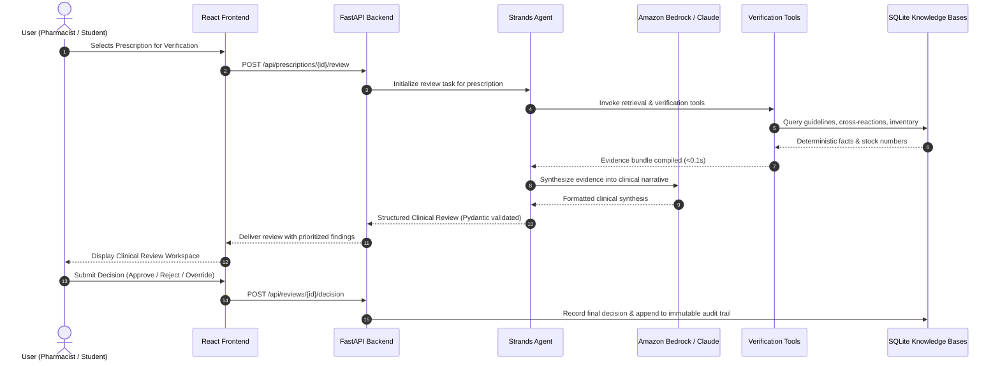

# PharmacyGuard Architecture


This document details the technical architecture of **PharmacyGuard**, illustrating its end-to-end system flow, modular component design, agent orchestration patterns, and Human-in-the-Loop safety boundaries.

---

## System Flow

The clinical verification lifecycle follows a deterministic, unidirectional pipeline that ensures every automated finding is subject to human oversight:

```
User (Pharmacist / Student)
  │
  ▼
React Frontend
  │  (HTTP REST / Bearer JWT)
  ▼
FastAPI Backend
  │  (Request Validation & Session Gate)
  ▼
Strands Agent
  │  (Agent Orchestration & Context Assembly)
  ▼
Amazon Bedrock / Claude
  │  (Pharmacological Reasoning & Synthesis)
  ▼
Verification Tools
  │  (Deterministic Clinical Logic & Calculations)
  ▼
SQLite Knowledge Bases
  │  (Clinical Guidelines, Drug Data & Hospital Inventory)
  ▼
Structured Clinical Review
  │  (Normalized Pydantic JSON Schema with Evidence)
  ▼
Human Review
  │  (Licensed Pharmacist Authorization / Override Rationale)
  ▼
Immutable Audit Log & Dispensing Execution
```

### End-to-End Sequence Diagram



---

## Components

```
+-----------------------------------------------------------------------------------+
|                                  REACT FRONTEND                                   |
|   React 19  •  TypeScript  •  Vite  •  Tailwind CSS  •  Lucide Icons             |
+-----------------------------------------+-----------------------------------------+
                                          │  REST API (HTTP / JWT)
+-----------------------------------------▼-----------------------------------------+
|                                 FASTAPI BACKEND                                   |
|   Python 3.10+  •  FastAPI  •  JWT Auth  •  Role-Based Access Control (RBAC)     |
+--------------------+------------------------------------+-------------------------+
                     │                                    │
          Orchestration & Reasoning                   SQL Queries
                     │                                    │
+--------------------▼---------------+   +----------------▼-------------------------+
|              AGENT                 |   |             KNOWLEDGE LAYER              |
|   Strands Agents SDK               |   |   SQLite Dual-Database Design            |
|   Amazon Bedrock                   |   |   - Clinical Knowledge Base              |
|   Anthropic Claude                 |   |   - Pharmacy Inventory Database          |
+------------------------------------+   +------------------------------------------+
```

---

### Frontend

The presentation tier is engineered as a responsive single-page application focused on high-efficiency clinical workflows:

- **React 19:** Leverages modern React architecture, concurrent rendering, and clean functional components with Context API for centralized session and review state.
- **TypeScript:** Enforces strict compile-time typing across prescription objects, drug dosage items, AI finding categories, and user profile contracts.
- **Vite:** Next-generation frontend tooling providing sub-second hot module replacement (HMR) and optimized tree-shaken production bundles.
- **Tailwind CSS:** Modern utility-first styling utilizing custom medical color palettes, accessible contrast ratios, responsive grid layouts, and color-coded clinical severity badges (`CLEAR` 🟢, `REVIEW` 🟡, `HIGH_PRIORITY_REVIEW` 🔴).

#### Key Frontend Workspaces:
1. **Prescription Review Queue:** Real-time triage inbox listing pending orders grouped by urgency.
2. **Clinical Verification Studio:** Dual-pane layout presenting patient profile and ordered medications alongside Strands AI clinical evidence cards.
3. **Student Simulation Workspace:** Educational sandbox presenting blind cases, interactive assessment quizzes, and AI coaching comparison scores.
4. **Real-Time Inventory Tracker:** Live formulary monitoring table with search, low-stock warnings, and manual stock adjustment modals.
5. **Chief Pharmacist Analytics:** Executive dashboard displaying prescription throughput, clinical override ledgers, and staff workload distribution.

---

### Backend

The application and routing tier is built with Python for high throughput, asynchronous I/O, and seamless AI SDK interoperability:

- **Python (3.10+):** Provides the robust foundation for asynchronous API services, scientific libraries, and AWS SDK integration.
- **FastAPI:** High-performance web framework featuring automatic OpenAPI documentation, asynchronous request handling, and native dependency injection.
- **JWT Authentication:** Stateless JSON Web Token (JWT) session security signed using HMAC-SHA256 (`HS256`), carrying user credentials and expiration claims.
- **Role-Based Access Control (RBAC):** Fine-grained permission decorators that govern endpoint access:
  - `STAFF_PHARMACIST`: Can review prescriptions, execute clinical checks, approve routine orders, reject unsafe orders, and override safety flags with mandatory justification.
  - `CHIEF_PHARMACIST`: Full staff privileges plus operational analytics, audit ledger inspection, and inventory reorder controls.
  - `PHARMACY_STUDENT`: Access to training cases and simulation tools; strictly blocked from authorizing live dispensing.
  - `ADMIN`: User account management and platform health monitoring.

---

### Agent

The reasoning engine coordinates deterministic safety checks with foundation model intelligence:

- **Strands Agents SDK (`strands-agents>=1.0.0`):** Manages conversational state, system prompts, tool registration, and execution loops.
- **Amazon Bedrock:** AWS-managed service providing secure, enterprise-grade model invocation without third-party data egress.
- **Anthropic Claude (`us.anthropic.claude-sonnet-4-6`):** Foundation model configured at temperature `0.1` to maximize factual determinism and pharmacological precision.
- **Hybrid Execution Engine:**
  - **Phase 1 (Python Tools):** Executes all 6-8 clinical checks deterministically against SQLite in `<0.1s`.
  - **Phase 2 (Bedrock Synthesis):** Sends aggregated evidence in a single turn to Claude Sonnet for coherent clinical narration.
  - **Phase 3 (Fallback Cutoff):** Employs a non-blocking `ThreadPoolExecutor` with a 14.0-second timeout. If Bedrock times out or errors, PharmacyGuard automatically invokes its deterministic fallback engine, guaranteeing zero stalled clinical requests.

---

### Knowledge Layer

The data persistence tier uses a clean dual-database SQLite architecture that separates hospital patient records from clinical reference compendia:

- **SQLite:** Lightweight, ACID-compliant relational database engine operating in Write-Ahead Logging (WAL) mode for high-concurrency read/write operations.
- **Clinical Knowledge Base (`pharmacyguard.db`):**
  - `medication_reference`: Generic/brand names, therapeutic classes, min/max single doses, and 24-hour daily dose ceilings.
  - `diagnosis_medication_guidelines`: ICD-10 diagnostic indications mapped to first-line and second-line guideline therapies.
  - `allergy_cross_reactions`: Immunological cross-reactivity matrices (e.g., penicillins $\rightarrow$ aminopenicillins $\rightarrow$ cephalosporins).
  - `drug_interactions`: Pharmacokinetic and pharmacodynamic interaction pairs with severity levels and clinical recommendations.
  - `pharmacist_reviews` & `review_findings`: Historical clinical determinations and AI-generated findings.
  - `audit_events`: Cryptographically verifiable, append-only security and decision ledger.
- **Pharmacy Inventory Database:**
  - `medication_inventory`: Live hospital pharmacy formulary tracking 50+ essential medications, on-hand quantities, reorder thresholds, batch lot numbers, and expiration dates.
- **Hospital EHR Simulation (`hospital_sim.db`):**
  - Simulates external electronic medical records (`patients`, `allergies`, `diagnoses`, `prescriptions`, `prescription_medications`), abstracted behind a swappable `HospitalRepository` interface that enables drop-in FHIR/HL7 integration.

---

## Human-in-the-Loop

**The agent provides evidence and findings but does not independently authorize dispensing.**

PharmacyGuard enforces strict Human-in-the-Loop (HITL) architectural barriers:

1. **Zero Autonomous Dispensing:** The AI agent operates exclusively in an advisory capacity. It is programmatically incapable of marking an electronic prescription as dispensed or routing medication to nursing units.
2. **Mandatory Clinical Override Justification:** When a pharmacist chooses to approve an order flagged as `HIGH_PRIORITY_REVIEW` (such as a severe allergy conflict or major drug interaction), the system mandates written clinical rationale. The backend rejects override submissions without justification.
3. **Role-Segregated Authorization:** Pharmacy students can practice evaluations in the simulation workspace, but only licensed human pharmacists can finalize live inpatient/outpatient orders.
4. **Permanent Medicolegal Audit Trail:** Every recommendation provided by the agent, along with the human pharmacist's final decision, timestamps, and justification, is permanently preserved in the immutable audit ledger.
