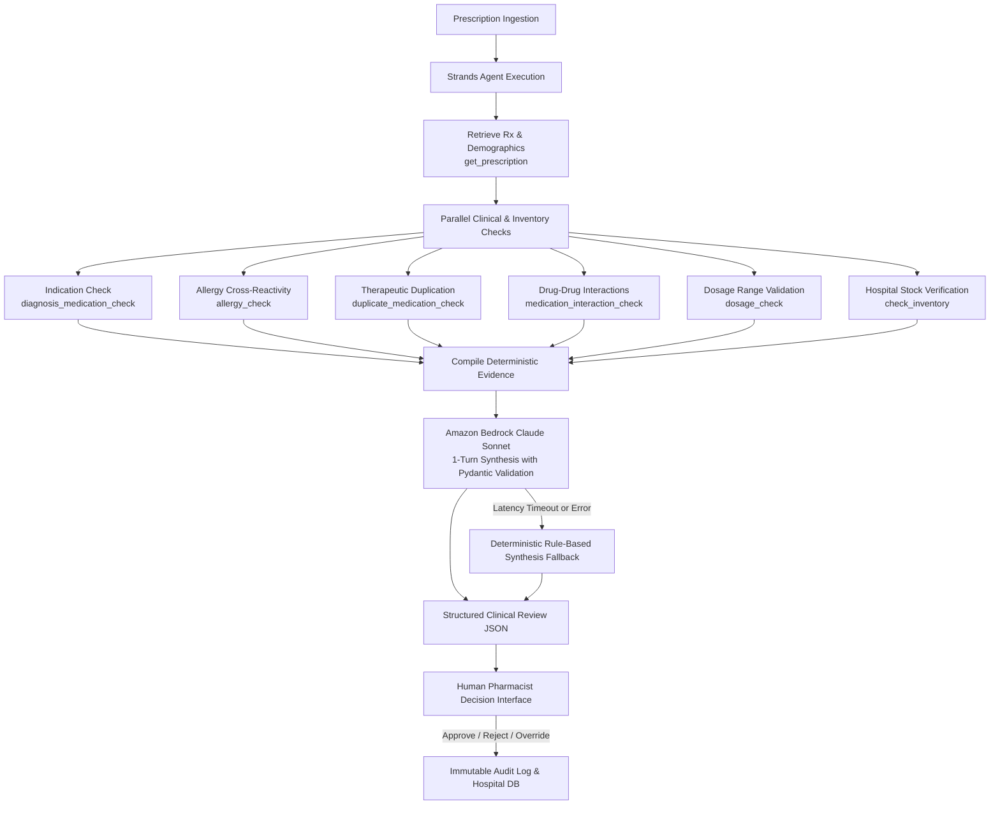
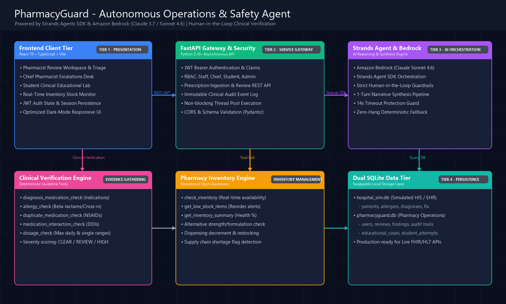

# PharmacyGuard

AI Clinical Verification Agent for Pharmacists & Pharmacy Students

[](LICENSE)
[](https://github.com/strands-agents)
[](https://aws.amazon.com/bedrock/)
[](https://fastapi.tiangolo.com/)
[](https://react.dev/)
[](https://tailwindcss.com/)

> **Built for the Amazon Agents for Humans Hackathon.**  
> PharmacyGuard is an AI clinical verification and pharmacy operations agent that empowers licensed pharmacists and pharmacy students to catch prescribing errors, verify clinical guidelines, check simulated hospital inventory, and safeguard patient outcomes—all under strict **Human-in-the-Loop (HITL)** governance.

---

## Overview

In modern healthcare settings, hospital pharmacies handle hundreds of complex inpatient and outpatient prescriptions daily. Pharmacists must cross-reference patient diagnoses, recorded allergies, drug-drug interactions, age-adjusted dosage limits, and on-hand medication inventory under tight time constraints. 

**PharmacyGuard** acts as an always-on clinical copilot powered by the **Strands Agents SDK** and **Amazon Bedrock (Anthropic Claude Sonnet)**. The agent retrieves structured hospital electronic health records, executes deterministic clinical safety tools, verifies pharmacy stock levels, synthesizes comprehensive decision-support reports, and surfaces prioritized flags directly to the clinician.

Simultaneously, PharmacyGuard provides a dedicated **Student Simulation Workspace**, allowing pharmacy residents and students to practice real-world clinical evaluations, submit clinical judgements, and receive instant AI coaching feedback.

---

## Problem

Medication errors represent one of the leading causes of preventable patient harm globally:
1. **Adverse Drug Events (ADEs):** Unintentional drug interactions and missed documented allergies (such as penicillin-cephalosporin cross-reactivity) lead to severe allergic reactions and readmissions.
2. **Indication Inconsistencies:** Prescriptions written for off-guideline indications or mismatched diagnostic codes (e.g., an antihypertensive prescribed for an isolated diabetes diagnosis) frequently go unnoticed.
3. **Dosage & Duplication Risks:** Accidental therapeutic duplicates (e.g., concurrent dual NSAIDs) or dosages exceeding standard therapeutic ceilings risk severe nephrotoxicity and gastrointestinal injury.
4. **Supply Chain Friction:** Pharmacists often discover that a drug or dosage strength is out of stock only after completing clinical verification, leading to clinical delays and rework.
5. **Alert Fatigue:** Traditional clinical decision support (CDS) rules bombard pharmacists with low-priority popups, causing alert fatigue.
6. **Training Gaps for Pharmacy Students:** Pharmacy interns lack safe, interactive clinical simulation platforms that mirror hospital electronic records with instant expert-level verification feedback.

---

## Solution

PharmacyGuard tackles these challenges through an intelligent, layered architecture:
- **Intelligent Strands Agent:** Uses Amazon Bedrock to orchestrate multi-tool clinical investigation, combining deterministic evidence retrieval with reasoning.
- **Deterministic Clinical Verification Engine:** Executes mathematical and rule-based checks against local clinical knowledge bases (drug-disease guidelines, allergy cross-reactivity matrices, dosage boundaries, and drug interaction tables) with zero hallucinations.
- **Real-Time Inventory Awareness:** Interrogates simulated hospital pharmacy inventory to determine whether prescribed drugs are `AVAILABLE`, `LOW STOCK`, `OUT OF STOCK`, or `STRENGTH UNAVAILABLE`.
- **Triaged Safety Priorities:** Synthesizes findings into actionable risk categories (`CLEAR`, `REVIEW`, `HIGH_PRIORITY_REVIEW`), enabling pharmacists to focus their time where patient safety is most endangered.
- **Strict Human-in-the-Loop (HITL) Guardrail:** The AI agent **never** dispenses, alters dosages, or approves prescriptions autonomously. It provides decision-support evidence; only licensed pharmacists can approve, reject, or override with mandatory clinical documentation.
- **Interactive Student Learning Mode:** Enables pharmacy students to practice blind prescription analysis, compare their clinical decisions against the agent's findings, and receive automated scoring and educational explanations.

---

## Key Features

- **Multi-Factor Clinical Verification:** Instant checks for indication alignment, documented allergy conflicts, therapeutic duplications, drug-drug interactions, and maximum daily dose limits.
- **Simulated Stock & Formulary Checks:** Integrates clinical verification with simulated hospital inventory to surface stockouts and alternative strength needs instantly.
- **One-Click Demo Authentication:** Preconfigured role-based access control (RBAC) supporting **Staff Pharmacist**, **Chief Pharmacist**, **Pharmacy Student**, and **Administrator** profiles.
- **Pharmacist Decision-Support Dashboard:** Clean visual badges (`CLEAR`, `REVIEW`, `HIGH_PRIORITY_REVIEW`), expandable clinical evidence cards, and 1-click action buttons.
- **Mandatory Clinical Override Rationale:** When a pharmacist overrides an AI-identified risk flag, entering a clinical justification is mandatory, preserving complete medicolegal accountability.
- **Immutable Clinical Audit Trail:** Every verification, approval, rejection, override, stock adjustment, and login attempt is cryptographically logged in an append-only audit database.
- **Student Simulation Workspace:** Dedicated case scenarios, interactive clinical quizzes, submission comparisons, and personalized educational feedback.
- **Chief Pharmacist Operations & Workload Analytics:** Operational metrics on prescription throughput, clinical override rates, inventory health, and staff workload.

---

## How the Agent Works

PharmacyGuard's agent is engineered using the **Strands Agents SDK** and backed by **Amazon Bedrock (Claude Sonnet)**. The agent employs a hybrid execution pattern designed for healthcare reliability:



1. **Deterministic Evidence Gathering:** When a prescription is ingested, PharmacyGuard queries the local SQLite clinical knowledge base via specialized Python tools in `<0.1s`.
2. **Context Synthesis:** The gathered evidence, patient demographics, active diagnoses, and prescribed regimens are structured into a prompt for the Strands agent.
3. **Bedrock Reasoning:** Amazon Bedrock synthesizes the multi-source evidence into clear clinical narratives, prioritizing critical findings and highlighting actionable guidance.
4. **Resilient Fallback Engine:** If the LLM call experiences high network latency or API rate limits, PharmacyGuard gracefully falls back to a deterministic rule-based synthesis engine, ensuring verification decision support and evaluation continue without interruption.

For full architectural details, see [AGENT.md](AGENT.md) and [docs/agent-workflow.md](docs/agent-workflow.md).

---

## Agent Tools

PharmacyGuard equips the Strands agent with **9 purpose-built tools** categorized into three operational domains:

| Category | Tool Name | Description | Output Priority |
|---|---|---|---|
| **Prescription Retrieval** | `get_prescription` | Retrieves patient demographics, active ICD-10 diagnoses, documented allergies, and full medication order details from the simulated hospital database. | `CLEAR` / `ERROR` |
| **Clinical Verification** | `diagnosis_medication_check` | Validates whether the prescribed drug matches recognized therapeutic guidelines for the patient's active diagnosis. | `CLEAR` / `REVIEW` |
| **Clinical Verification** | `allergy_check` | Detects direct drug allergy conflicts and beta-lactam / cephalosporin cross-reactivities against recorded patient allergies. | `CLEAR` / `HIGH_PRIORITY_REVIEW` |
| **Clinical Verification** | `duplicate_medication_check` | Identifies concurrent active ingredient duplications or therapeutic class redundancies (e.g., dual oral NSAIDs). | `CLEAR` / `HIGH_PRIORITY_REVIEW` |
| **Clinical Verification** | `medication_interaction_check` | Evaluates multi-drug regimens against drug-drug interaction reference pairs for pharmacodynamic and pharmacokinetic hazards. | `CLEAR` / `HIGH_PRIORITY_REVIEW` |
| **Clinical Verification** | `dosage_check` | Validates single-dose and calculated daily dose against standard therapeutic boundaries and absolute toxic ceilings. | `CLEAR` / `REVIEW` / `HIGH_PRIORITY_REVIEW` |
| **Inventory & Operations** | `check_inventory` | Interrogates the simulated hospital pharmacy formulary to check stock availability, low-stock warnings, and missing strength formulations. | `AVAILABLE` / `LOW STOCK` / `OUT OF STOCK` |
| **Inventory & Operations** | `get_low_stock_items` | Returns all pharmacy catalog items currently at or below configured reorder levels for restocking workflows. | Operational Summary |
| **Inventory & Operations** | `get_inventory_summary` | Provides aggregate pharmacy supply metrics, stock health percentages, and reorder alerts. | Operational Summary |

For full input/output schemas and code signatures, see [TOOLS.md](TOOLS.md).

> [!NOTE]
> **Dosage Engine Scope & Format Handling:** The `dosage_check` tool parses standard milligram dosages and recognized frequency intervals (`TID`, `BID`, `QID`, `Once daily`, `Every 8 hours`, etc.) against curated reference ranges. If an unmapped medication or unrecognized dosage/frequency format is encountered, the tool applies a conservative `1.0` multiplier fallback, flags the order for mandatory human `REVIEW`, and prompts the pharmacist for manual calculation. It is a prototype decision-support heuristic, not a generalized pharmacokinetic calculator. See [TOOLS.md](TOOLS.md) and [Limitations](#limitations).

---

## Technology Stack

### Backend & Agent Core
- **Agent Framework:** [Strands Agents SDK](https://github.com/strands-agents) (`strands-agents>=1.0.0`)
- **Foundation Model:** [Amazon Bedrock](https://aws.amazon.com/bedrock/) (`us.anthropic.claude-sonnet-4-6` or `us.anthropic.claude-3-5-sonnet-20241022-v2:0`)
- **API Framework:** [FastAPI](https://fastapi.tiangolo.com/) (`fastapi>=0.115.0`) with [Uvicorn](https://www.uvicorn.org/)
- **Data Validation & Schemas:** [Pydantic v2](https://docs.pydantic.dev/) (`pydantic>=2.7.0`)
- **Database & Storage:** SQLite3 (Dual-database design: `pharmacyguard.db` and `hospital_sim.db`)
- **Cloud SDK:** [AWS SDK for Python (Boto3)](https://boto3.amazonaws.com/v1/documentation/api/latest/index.html)

### Frontend & User Interface
- **Framework:** [React 19](https://react.dev/) + [TypeScript](https://www.typescriptlang.org/)
- **Build Tool:** [Vite 8](https://vite.dev/)
- **Styling:** [Tailwind CSS v4](https://tailwindcss.com/)
- **Icons:** [Lucide React](https://lucide.dev/)
- **State & Auth:** React Context API with JWT session management

---

## Architecture

```
                                  +---------------------------------------+
                                  |     React 19 + Vite + Tailwind CSS    |
                                  |   (Staff / Chief / Student / Admin)   |
                                  +-------------------+-------------------+
                                                      |
                                              REST API (HTTP / JWT)
                                                      |
                                  +-------------------v-------------------+
                                  |          FastAPI Application          |
                                  |    (Auth, Reviews, Prescriptions)     |
                                  +-------------------+-------------------+
                                                      |
                             +------------------------+------------------------+
                             |                                                 |
             +---------------v---------------+                 +---------------v---------------+
             |      Strands Agent Engine     |                 |     Hospital Data Layer       |
             |   - Amazon Bedrock (Claude)   |                 |   - SQLite (pharmacyguard.db) |
             |   - 9 Verification Tools      |                 |   - SQLite (hospital_sim.db)  |
             |   - Deterministic Fallback    |                 |   - Immutable Audit Logs      |
             +-------------------------------+                 +-------------------------------+
```



PharmacyGuard separates clinical decision-support reasoning from the simulated hospital repository data layer across four decoupled architectural tiers. A detailed architectural breakdown and system data flows can be found in [ARCHITECTURE.md](ARCHITECTURE.md).

---

## Human-in-the-Loop Design

Patient safety is paramount. PharmacyGuard adheres to **4 foundational Human-in-the-Loop (HITL) principles**:

1. **Zero Autonomous Dispensing:** The AI agent acts strictly in an advisory capacity. It can **never** mark a prescription as dispensed, alter prescriptions, or route medication to nursing stations autonomously.
2. **Mandatory Override Justification:** If a pharmacist elects to approve a prescription flagged as `HIGH_PRIORITY_REVIEW` (e.g., severe allergy risk or critical drug interaction), the system enforces a mandatory clinical explanation field. Approvals without documentation are rejected by the API.
3. **Role-Based Segregation of Duties:** Students can assess cases but cannot finalize dispensing. Staff Pharmacists can approve standard workflows. Chief Pharmacists oversee overrides and operational analytics.
4. **Permanent Audit Accountability:** Every recommendation provided by the agent, along with the human pharmacist's final decision, timestamps, and justification, is stored in an immutable audit ledger for hospital compliance.

For complete safety policies, see [SECURITY.md](SECURITY.md).

---

## Getting Started

### Prerequisites
- **Python:** 3.10, 3.11, or 3.12
- **Node.js:** 18.x or later (and `npm`)
- **AWS Bedrock Access:** AWS credentials or an `AWS_BEARER_TOKEN_BEDROCK` with permissions for Claude Sonnet in `us-east-1`. *(Note: PharmacyGuard includes full deterministic execution if no Bedrock token is present!)*

### Step-by-Step Setup from a Clean Clone

```powershell
# 1. Clone the repository
git clone https://github.com/Nana-996/PharmacyGuard.git
cd PharmacyGuard

# 2. Create and activate Python virtual environment
python -m venv .venv
.venv\Scripts\activate

# 3. Install backend dependencies
pip install -r backend/requirements.txt

# 4. Copy environment configuration
copy .env.example .env
```

For comprehensive step-by-step installation instructions, see [SETUP.md](SETUP.md).

---

## Environment Variables

| Variable | Required | Default | Description |
|---|---|---|---|
| `AWS_BEARER_TOKEN_BEDROCK` | Yes (for live Bedrock) | `None` | AWS Bedrock API key or Bearer Token for model invocation. |
| `AWS_DEFAULT_REGION` | Yes | `us-east-1` | AWS region where Bedrock model access is enabled. |
| `BEDROCK_MODEL_ID` | Yes | `us.anthropic.claude-sonnet-4-6` | Amazon Bedrock Claude model ID. |
| `JWT_SECRET_KEY` | Optional | *Auto-generated ephemeral CSPRNG* | Secret key for signing session JWT tokens. Set in `.env` for persistent sessions. |
| `CORS_ALLOWED_ORIGINS` | Optional | `http://localhost:5173,...` | Comma-separated list of allowed web client origins. |

See [.env.example](.env.example) for a complete template.

---

## Running the Application

### 1. Launch the Backend API (Terminal 1)
```powershell
# Activate your virtual environment
.venv\Scripts\activate

# Launch FastAPI on port 8000
python -m uvicorn backend.main:app --reload --port 8000
```
- API Documentation: [http://127.0.0.1:8000/docs](http://127.0.0.1:8000/docs)
- Health Check: [http://127.0.0.1:8000/health](http://127.0.0.1:8000/health)

### 2. Launch the Frontend Interface (Terminal 2)
```powershell
cd frontend
npm install
npm run dev
```
- Web Application: [http://localhost:5173](http://localhost:5173)

---

## Testing the Agent

### Preloaded Test Cases for Hackathon Judges
PharmacyGuard includes 5 fictional clinical test scenarios that demonstrate the agent's multi-tool clinical reasoning:

| Prescription ID | Patient | Active Diagnosis | Prescribed Medication(s) | Expected Clinical Scenario | Agent Status |
|---|---|---|---|---|---|
| **`RX-1001`** | John Doe (34M) | J02.0 - Streptococcal pharyngitis | Amoxicillin 500mg (q8h x 10d) | **Normal Prescription:** Guideline match, no allergies, in stock. | `CLEAR` |
| **`RX-1002`** | Jane Smith (52F) | E11.9 - Type 2 diabetes mellitus | Lisinopril 20mg (qd) | **Indication Mismatch:** Antihypertensive prescribed for diabetes without hypertension diagnosis. | `REVIEW` |
| **`RX-1003`** | Robert Taylor (61M) | J01.90 - Acute bacterial sinusitis | Augmentin 875/125mg (q12h) | **Severe Allergy Conflict:** Documented severe penicillin anaphylaxis cross-reacts with Augmentin. | `HIGH_PRIORITY_REVIEW` |
| **`RX-1004`** | Emily Davis (45F) | M17.9 - Osteoarthritis of knee | Ibuprofen 600mg + Naproxen 500mg | **Duplicate Therapy:** Concurrent prescription of two systemic NSAIDs multiplies bleeding risk. | `HIGH_PRIORITY_REVIEW` |
| **`RX-1005`** | Michael Chen (68M) | I10 - Essential hypertension | Atorvastatin, Metformin, Lisinopril, Amlodipine | **Polypharmacy & Inventory:** Complex 4-drug cardiovascular regimen + stock availability check. | Multi-Drug Verified |

### Running Automated Test Suites
Run the full automated test suite containing 12 test modules covering agent integration, clinical verification tools, inventory management, and RBAC:
```powershell
python -m unittest discover -s backend/tests -p "test_*.py"
```

For full judge testing procedures, see [TESTING.md](TESTING.md).

---

## Demo

### 1-Click Login Accounts
On the login screen ([http://localhost:5173](http://localhost:5173)), quick-login cards allow instant testing:

- 🩺 **Staff Pharmacist:** `staff.pharmacist@hospital.dev` (Password: `DevStaff123!`) — Review queue, AI clinical verification, approve/override workflows.
- 📊 **Chief Pharmacist:** `chief.pharmacist@hospital.dev` (Password: `DevChief123!`) — Clinical analytics, staff oversight, override logs, stock management.
- 🎓 **Pharmacy Student:** `student@hospital.dev` (Password: `DevStudent123!`) — Interactive case simulations, blind reviews, instant scoring and mentoring.

See [docs/screenshots/README.md](docs/screenshots/README.md) for UI walkthrough images and screen tours.

---

## Data & Privacy

- **100% Synthetic Data:** All patient records, diagnoses, medical record numbers, prescription orders, and doctor names are entirely fictional and synthetically generated.
- **Zero Protected Health Information (PHI):** No real patient data is stored, processed, or transmitted.
- **HIPAA Compliant by Design:** PharmacyGuard was developed adhering to HIPAA Safe Harbor and de-identification principles, ensuring safe deployment in development and evaluation environments.
- **Local SQLite Isolation:** All hospital records and clinical guideline references are stored in local SQLite databases without external cloud data leaks.

For detailed schema descriptions, see [DATA.md](DATA.md).

---

## Future Development

- **FHIR & HL7 Integration:** Native adapters for Epic Systems, Cerner (Oracle Health), and SMART on FHIR electronic health record integrations.
- **Multi-Hospital Inventory Federation:** Automated inter-facility inventory transfer requests when medications are out of stock.
- **Genomic & Pharmacogenomic (PGx) Screening:** Integration of CPIC guidelines for CYP2D6 / CYP2C19 metabolizer status checks.
- **Prescriber Voice Orders:** Ambient clinical transcription and instant real-time order verification during physician rounds.

---

## Limitations

- **Dosage Engine Scope & Recognized Formats:** The deterministic dosage verification tool (`dosage_check`) operates on supported synthetic reference data and recognized dosage/frequency formats (e.g., numeric mg values and common interval sigs). It is a prototype decision-support heuristic, not a general-purpose clinical dosage engine (e.g., it does not compute renal CrCl adjustments, body surface area, pediatric mg/kg weight curves, or complex IV titrations).
- **Graceful Handling of Unrecognized Formats:** 
  - *What happens when a frequency format isn't recognized?* If a frequency string cannot be matched to known hourly or daily cadences (e.g., non-standard PRN text, tapering schedules), the daily multiplier conservatively defaults to `1.0` (single daily dose assumption) while preserving the full raw prescription string for clinician inspection.
  - *What happens when a dose or drug isn't in reference data?* If a dose cannot be parsed numerically or a medication lacks a stored reference ceiling in `medication_reference`, the engine flags the item as `REVIEW`, displays a missing-reference alert, and routes the verification to the licensed pharmacist under Human-in-the-Loop governance.
- **Synthetic Clinical Guidelines:** The current demonstration utilizes a curated clinical knowledge base covering common cardiovascular, metabolic, anti-infective, and analgesic drugs. It does not replace full-scale commercial compendia (e.g., Lexicomp or Micromedex).
- **Decision-Support Scope:** PharmacyGuard does not provide definitive medical diagnoses, autonomously modify orders, or prescribe medications. Final dispensing responsibility rests exclusively with the licensed human pharmacist.
- **Evaluation Sandbox:** Real-world hospital deployment requires connection to institutional identity providers (SAML / OAuth2) and validated clinical EHR endpoints (FHIR / HL7).

---

## License

This project is licensed under the **MIT License**. See the [LICENSE](LICENSE) file for details.
